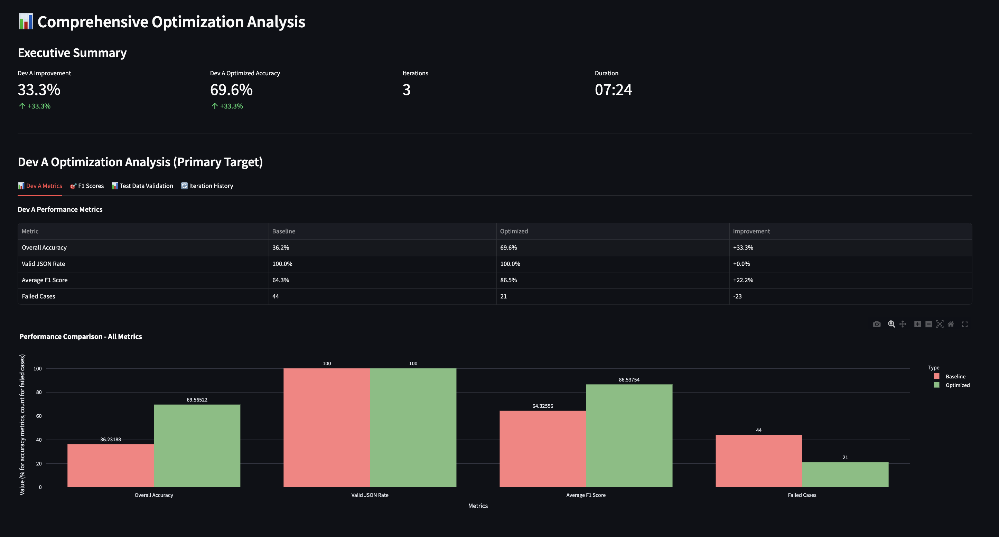
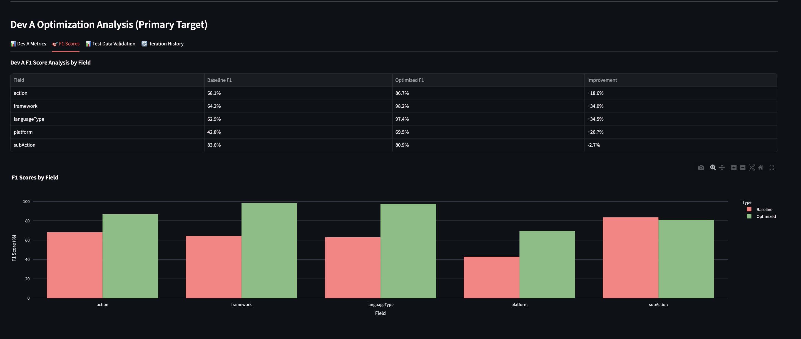
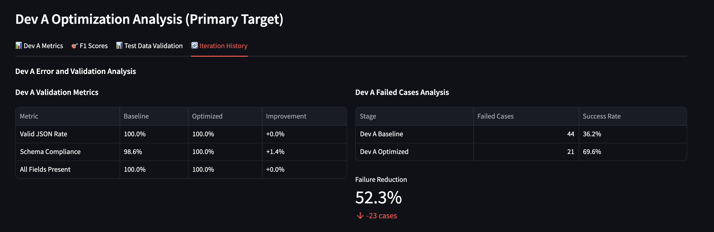

# HITL-Based Prompt Optimization System

## **System Overview**

The Prompt Optimization System is an automated system that optimizes prompts for JSON classification tasks. It uses a multi-stage evaluation process with human feedback integration to iteratively improve prompt performance across different model providers.

### **Key Features:**

- **Multi-Model Support**: Supports OpenAI, Anthropic, Google, and Groq models
- **Stratified Data Splitting**: Intelligent 25/35/20/20 train/dev_a/dev_b/test splits
- **Intent Analysis**: Understanding of classification goals using Claude.
- **Human-in-the-Loop**: LangFuse integration for human feedback collection
- **Comprehensive Metrics**: 15+ evaluation metrics with field-specific analysis

### **Complete Optimization Workflow**

The system follows a structured 5-step optimization process:

<!-- add image -->


## Results





## Project Structure

```
PERSONAL_PROJECT/
├── Backend/                          # Core optimization system
│   ├── prompt_optimizer/            # Core optimization logic
│   │   ├── core/                   # Main optimization components
│   │   ├── models/                 # Data models and types
│   │   ├── optimizers/             # Optimization strategies
│   │   └── utils/                  # Utilities and helpers
│   ├── fastapi_optimization_system/ # FastAPI web service
│   │   ├── app/                    # FastAPI application
│   │   ├── main.py                 # FastAPI entry point
│   │   └── requirements.txt        # FastAPI dependencies
│   └── requirements.txt             # Backend dependencies
├── Frontend/                        # Streamlit web interface
│   ├── app.py                      # Streamlit application
│   └── requirements.txt            # Frontend dependencies
└── README.md                       # This file
```

## Setup Instructions

### Prerequisites

- Python 3.8 or higher
- MongoDB (for token usage logging)
- Git

### 1. Clone the Repository

```bash
git clone <repository-url>
cd PERSONAL_PROJECT
```

### 2. Backend Setup

#### Install Dependencies

```bash
cd Backend
pip install -r requirements.txt
```

#### Environment Configuration

1. Create environment file:
```bash
cp .env.example .env
```

2. Edit `.env` with your API keys:
```bash
# LLM API KEYS (at least one required)
ANTHROPIC_API_KEY=your_anthropic_api_key_here
OPENAI_API_KEY=your_openai_api_key_here
GROQ_API_KEY=your_groq_api_key_here
GEMINI_API_KEY=your_gemini_api_key_here

# LANGFUSE CONFIGURATION (for human feedback)
LANGFUSE_PUBLIC_KEY=your_langfuse_public_key_here
LANGFUSE_SECRET_KEY=your_langfuse_secret_key_here
LANGFUSE_HOST=https://cloud.langfuse.com
LANGFUSE_PROJECT_ID=your_project_id_here

# DATABASE (optional - for logging)
MONGODB_URL=mongodb://localhost:27017/
MONGODB_DB_NAME=personal_project_log_usage
```

#### Start FastAPI Server

```bash
cd Backend/fastapi_optimization_system
uvicorn main:app --reload --host 0.0.0.0 --port 8000
```

The API will be available at: http://localhost:8000

### 3. Frontend Setup

#### Install Dependencies

```bash
cd Frontend
```

#### Start Streamlit App

```bash
streamlit run app.py
```

The web interface will be available at: http://localhost:8501

#### LangFuse (Human Feedback)
1. Visit https://cloud.langfuse.com/
2. Create project
3. Get public/secret keys from settings
4. Add to `.env` as `LANGFUSE_PUBLIC_KEY` and `LANGFUSE_SECRET_KEY`

## **Conclusion**

The Prompt Optimization System represents a comprehensive solution for automated prompt improvement with human oversight. The architecture balances automation with human expertise, providing robust evaluation metrics and intelligent optimization strategies.

## Documentation Link

For detailed documentation, please refer to the [Prompt Optimization System Documentation](https://ionized-saxophone-5b4.notion.site/Prompt-Optimization-System-Comprehensive-Approach-Document-21d0cbade2d980f8ae86d8fc07ef6173?source=copy_link).
